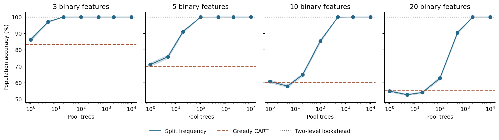
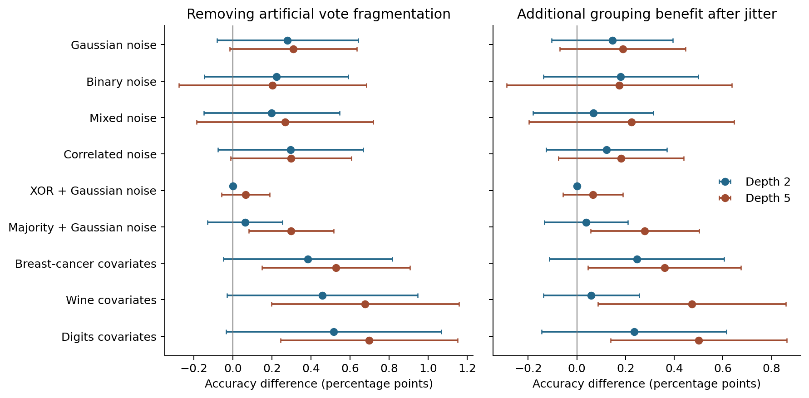
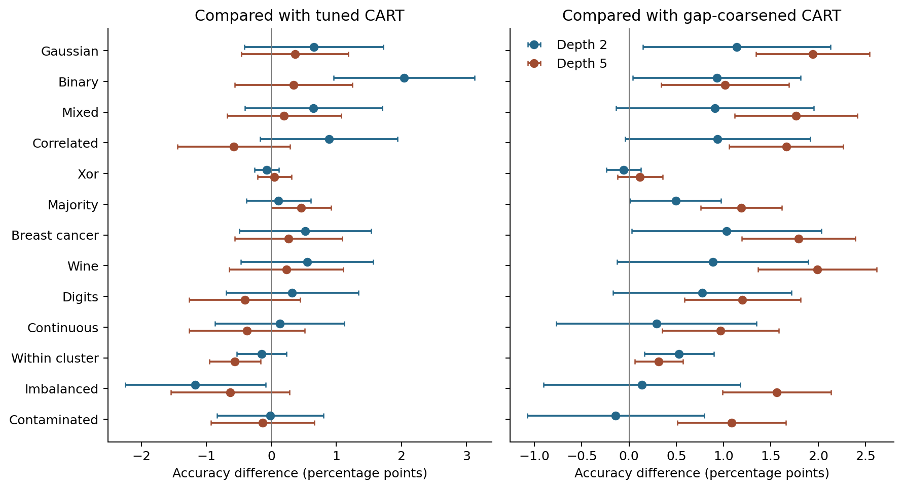

# Growing a more accurate single tree

CART chooses each split by its immediate reduction in training impurity. A split
can look unhelpful on its own yet make a later split highly predictive. Searching
many thresholds also gives irrelevant variables opportunities to look useful by
chance. The problem is to improve these choices while retaining one small,
readable prediction tree.

This project grows a tree from splits that recur across resampled CART trees.
A split can earn support wherever it appears in a proposal tree, including below
another split. The contribution is this use of global split recurrence, an exact
model showing how it can recover an interaction that greedy root scoring misses,
and experiments separating that mechanism from sampling error and tree size.
The experiments learn threshold groups from the training sample, use detected
gaps to propose splits that ordinary CART can miss, and use validation to choose
among the resulting learners and CART.

## From local split selection to global split reuse

Resampling and validation already offer ways to improve a single tree.
[Dannegger's node voting](https://epub.ub.uni-muenchen.de/1466/1/paper_72.pdf)
chooses variables by bootstrap votes and uses median cutpoints at each node.
[ALOOF](https://arxiv.org/abs/1512.03444) chooses a variable by leave-one-out
predictive loss, then fits its CART threshold.
[Consolidated Tree Construction](https://www.scitepress.org/PublishedPapers/2004/26022/)
coordinates node choices across subsamples. These methods motivate comparisons
with local resampling and validation, rather than only default CART.

Global split reuse takes information from independently grown tree structures.
A feature-threshold pair found deep in one proposal can be considered at the
root of the final tree. That is the distinction from voting among proposals made
within a common node. The construction studied here is a specific experiment
within established work on improving single trees; the mathematical result below
identifies a setting in which its information is useful.

The algorithm is:

1. Fit $B$ CART trees to bootstrap samples or subsamples of the training data.
2. For each exact feature-threshold pair $s$, count the fraction of trees in
   which it appears at least once:
   $\widehat q_s=B^{-1}\sum_b\mathbf 1\{s\in T_b\}$.
3. Grow one new tree. At each node, choose the admissible split with the largest
   support, subject to the depth, leaf-size, and support cutoffs. Estimate leaf
   labels from the training observations that reach them.

Prediction uses only the new tree. The proposal pool supplies candidate splits
and their scores.

The experiments vary two parts of the rule. Relative support divides all scores
by their maximum, changing which splits survive a cutoff without changing their
ranking. Impurity weighting uses $\widehat q_s\exp(-\lambda L_s)$, where $L_s$
is half the weighted child Gini impurity. A separate comparison scores node
proposals by holdout classification error. These alternatives isolate the roles
of recurrence, local impurity, and predictive loss.

## A case where split recurrence improves the tree

Let $X_1,\ldots,X_p$ be independent balanced bits, $p\geq3$, and let
$Y=X_1\mathbin{\mathrm{XOR}}X_2$. Each variable alone has zero population Gini
gain at the root. But splitting on $X_1$ and then $X_2$ gives a perfect tree of
depth two.

Consider depth-two greedy trees grown using exact population probabilities, allowing
zero-gain splits and resolving ties uniformly and independently at each node.
A signal root exposes the other signal in both children. A noise root leaves
both child searches tied. For a specified feature, the probability of appearing
somewhere in a proposal tree is

$$
a_p=1-\left(1-\frac1{p-1}\right)^2,\qquad
q_{\rm signal}=\frac2p+\frac{p-2}{p}a_p,\qquad
q_{\rm noise}=\frac1p+\frac{p-3}{p}a_p.
$$

Thus each signal has greater support than every noise variable, with gap
$\gamma=(1+a_p)/p>0$. Regrowing from the exact support values puts the two signal
variables at the first two levels and gives zero prediction error. A greedy
population CART tree has expected error $\tfrac12(1-2/p)$: it succeeds only when
its root is one of the two signals.

With $B$ independent proposal trees, a concentration argument gives

$$
\mathbb E[R(T_B)]\leq
\min\!\left\{\frac12,(p-2)e^{-B\gamma^2/2}\right\}.
$$

Consequently, $B>2\log(2p)/\gamma^2$ is sufficient for smaller expected error
than greedy population CART. This is a whole-tree comparison in a specified
population, with a proof in [the mathematical note](docs/mechanisms.md#an-exact-model-where-global-support-exposes-the-interaction).
It assumes exact population split scores and leaf labels. Estimating those
quantities from a finite training sample is a separate source of error.



*The XOR population above, with two signal bits and the remaining bits irrelevant.
Each point averages 2,000 independently randomized proposal pools; final-tree
accuracy is calculated exactly, averaging over ties. Shading gives 95% Monte
Carlo intervals. CART and two-level lookahead are exact population benchmarks.*

The pool-size experiment illustrates the theorem and its limitation. With 20
features, 20 proposal trees give 54.0% mean accuracy, compared with CART's 55.0%.
At 100 and 500 proposal trees, accuracy rises to 62.7% and 90.4%. The support gap
shrinks as irrelevant variables accumulate, so a small pool can fail to recover
it. Two-level lookahead gets 100% directly in this population. Global recurrence
is one way to expose the interaction; it does not improve on direct lookahead
here.

## What changes with finite training data

A second mechanism concerns competition from noise thresholds. Let $X_1$ be a
balanced bit, flip its label independently with probability $\eta$, and add
independent Gaussian noise variables. The signal's population Gini gain is
$(1-2\eta)^2/2$. For $M$ candidate noise splits and $n$ training observations,

$$
\Pr\!\left(\max_s\widehat{\Delta G}_s\geq g\right)\leq2M e^{-ng}.
$$

The [derivation](docs/mechanisms.md#why-many-noise-features-matter-more-for-a-weak-signal)
explains why small samples, weak signals, and many candidate thresholds make
root selection difficult. The binary signal has one threshold; continuous noise
variables spread their support across many thresholds. This suggests a benefit
from recurrence, but the bound does not prove that a finite bootstrap pool ranks
the signal correctly.

The simulations vary sample size, noise strength, irrelevant-variable count,
objective disagreement, and interaction strength. A simulation replicate means
one independently generated training sample and a separate test sample of
10,000 observations from the same specified distribution. The initial grid has
20 replicates per condition. Selected comparisons use another 20 independently
generated training/test pairs with the distribution and tuning rules fixed.
These repetitions measure sampling variation within a population, not breadth
across 20 different prediction problems. The initial screen requires a gain in
at least 16 of 20 replicates and a positive lower endpoint of a paired 95%
interval; interaction gains must persist under each column permutation. This
is an exploratory screen without adjustment for searching across comparisons.

Three-fold validation chooses parameters using training data only. CART receives
a wider grid of depths, leaf sizes, and pruning penalties. Comparators include
ALOOF, node voting, greedy classification-error splits, and
[two-level lookahead](https://pschaus.github.io/assets/publi/ida2024_efficient_lookehead_decision_trees.pdf)
for binary predictors. Interaction results average three column permutations
within each replicate.

| Population | Tree-growing rule | Mean accuracy | Tuned CART | Difference, percentage points (95% interval) |
|---|---|---:|---:|---:|
| Binary signal, 19 Gaussian noise variables, $n=200$, 40% label flips | Relative bootstrap support, random ties | 56.5% | 51.7% | 4.8 [3.1, 6.5] |
| Same population | ALOOF | 54.1% | 51.7% | 2.4 [1.1, 3.7] |
| Binary XOR, 18 noise bits, $n=800$ | Impurity-weighted bootstrap support | 97.4% | 79.5% | 17.9 [11.0, 24.8] |
| Same XOR population | Two-level lookahead | 100.0% | 79.5% | 20.5 [14.8, 26.1] |

*Means and paired t intervals across the second set of 20 simulation replicates.
The settings were selected from the initial grid; these are within-population
comparisons. The finite-sample pools contain 20 trees and may grow to depth five,
so they differ from the population experiment above.*

For the weak binary signal, the recurrence gain remains positive when depth,
minimum leaf size, and pool size are perturbed. With $n=800$, CART identifies the
signal more reliably and the mean accuracy difference falls to about half a
percentage point. The binary-versus-continuous predictor contrast is part of the
experiment: it does not establish the same benefit for a continuous signal.

For binary XOR, the weighted method's high mean conceals a large failure in one
replicate: 52.0% accuracy versus CART's 70.8%. Lookahead reaches 100% in every
replicate. The finite-sample findings therefore favor direct lookahead in this
example. The population theorem explains a possible advantage from recurrence;
it does not explain away failures of the empirical implementation.

Holdout scoring addresses a different issue. Gini and classification error can
rank two splits differently even with known population probabilities. The
[exact counterexample](docs/mechanisms.md#gini-and-accuracy-can-prefer-different-splits)
and fixed-proposal simulation isolate that difference. On digits, common-fold
holdout scoring reaches 76.7% versus 66.8% for CART on the same small-tree tuning
grid. A wider CART grid reaches 85.2% with much larger trees. Wine shows no
holdout advantage. These real-data figures average five overlapping train/test
splits.

The [full comparisons](results/study/paired.csv),
[confirmation comparisons](results/confirmation/checks.csv),
[parameter perturbations](results/confirmation/perturbations/summary.csv), and
[accuracy-versus-size figure](results/study/figures/size.png) include gains and
failures. The mathematical note gives the proofs, the holdout selection bound,
and the conditions needed to connect a local split improvement to whole-tree
prediction error.

## Does threshold identity change the result?

It can, even when every proposal tree makes exactly the same predictions.
For a binary feature, thresholds 0.3 and 0.7 both separate zero from one. Giving
each proposal tree a different threshold inside that gap preserves its routing
but splits its votes across different numerical values. Grouping those votes
by their population partition removes this dependence on threshold identity.

In the weak-signal example above, with depth capped at two, artificially
fragmenting these votes reduces final-tree accuracy by **4.3 percentage points**
[3.2, 5.4]. The candidate partitions, training observations, proposal predictions,
and tie priorities stay fixed. The change isolates an effect of vote fragmentation.

A separate intervention replaces every constructed bit with $Z+.25U$, where
$U$ is independent uniform noise on $[-1,1]$. The bit remains exactly recoverable,
so Bayes accuracy stays unchanged. But CART's search changes. In the same
weak-signal setting, grouping the naturally occurring threshold votes adds only
**0.15 points** [-0.10, 0.40]. The useful partition appears in 84% of binary
proposal pools and 23.5% of jittered pools. Grouping cannot restore a missing
candidate. In jittered XOR with 10% label flips and depth five, grouping raises
accuracy from 55.0% to 67.5%: **12.5 points** [8.3, 16.7], against 90% Bayes
accuracy. Known population gaps define the groups in this
experiment. The next experiment learns groups and proposals from observed data.



*Each setting uses 200 independent replicates, 200 training observations, 40%
label flips, 20 proposal trees, and 5,000 paired evaluation observations.
Left: grouped support minus artificially fragmented exact support in the jittered
representation. Right: the grouping gain after jitter minus the grouping gain
before jitter. Bars and bracketed intervals above are approximate 95%
simultaneous Monte Carlo intervals adjusted for all 300 primary contrasts.
Breast-cancer, wine, and digits covariates supply independent nuisance backgrounds;
their original outcomes are not used.*

The [mathematical argument and design](docs/mechanisms.md#isolating-threshold-identity-from-predictive-information)
separate the frozen-pool intervention from changes in proposal quality.
The [full results](results/ablation/contrasts.csv) include all sample-size,
signal-strength, and depth settings. Across 6,000 paired replicates, every
required invariance passed: fixed-pool reconstruction preserves tree structure
under column reordering and doubling features and thresholds. Grouped votes
ignore threshold aliases, and unused features cannot change a fixed tree's
predictions. Refitting CART can legitimately react to column order through its
search; that sensitivity is measured separately.

## Learning groups and proposing useful splits

Two thresholds belong to the same empirical group when they split every training
observation identically. We represent that group by the midpoint of its empty
training interval and count each proposal tree at most once. Grouping this way
requires no knowledge of the population distribution.

Training equivalence is approximate outside the sample. For $n$ independent
draws from the same distribution with $p$ features, a uniform-spacing argument
gives, with probability at least $1-\alpha$, a simultaneous bound on the
population mass between any two training-equivalent thresholds:

$$
\epsilon_\alpha=1-\left[\frac{\alpha}{p(n+1)}\right]^{1/n}.
$$

At $n=200$, $p=20$, and $\alpha=.05$, this is about 5.5% per split. Replacing
thresholds at $L$ nodes of a fixed tree changes its risk by at most
$\min(1,L\epsilon_\alpha)$ on this event. Pooling votes can select different
partitions, so its accuracy effect requires a separate comparison.

To improve the proposals, we also look for a large gap in each training feature:
the largest admissible gap must exceed the observed range on either side.
For half the bootstrap trees, we replace a flagged feature by the indicator of
which side it occupies. The other half use the original features. This preserves
some opportunities to find useful splits within clusters. Prediction still uses
one ordinary tree, with thresholds on the original features.

[Discretization is established](https://ai.stanford.edu/~ronnyk/disc.pdf). The
question here is whether it supplies useful candidates for global split reuse,
and whether pooling equivalent candidates adds anything. We cross the proposal
change with the score change, holding candidates and tie priorities fixed within
each score comparison. CART with the same gap preprocessing tests whether that
simpler procedure already delivers the gain. Further baselines include tuned
CART, ALOOF, and node voting.

The [proof and experimental design](docs/mechanisms.md#learning-groups-and-improving-proposals)
specify when the gap rule recovers the true separation. They also distinguish a
gap in a predictor from a reason to discard its within-cluster information.

The learned groups recover an accuracy benefit without known population gaps.
For jittered XOR with $n=200$, 10% label flips, and depth five, changing only
the aggregation rule raises accuracy from **54.01% to 62.00%**: a gain of
**7.99 points** [4.14, 11.85]. Adding coarsened proposals lowers the point estimate
to 58.97%; its difference from raw grouped proposals is inconclusive.

For majority-of-three in the same regime, the combined procedure reaches
**89.95%**, versus **84.90% for tuned CART** and **88.31% for gap-CART**.
The paired gains are 5.05 points [3.84, 6.26] and 1.64 [0.52, 2.77], respectively.
Bayes accuracy is 90%. Grouping adds 3.83 points with raw proposals but essentially
nothing with mixed proposals: here the two changes largely substitute for each
other. These intervals adjust for all 680 primary contrasts across 34 settings
and two depth caps, each with 200 independent replicates.



*Combined procedure minus each baseline, with approximate 95% simultaneous Monte
Carlo intervals. This slice uses $n=200$, 40% label flips, 20 proposals, and 5,000
evaluation observations per replicate. Constructed bits use jitter $Z+.25U$;
breast-cancer, wine, and digits provide nuisance covariates, not their outcomes.*

The failures identify limits. With a weak signal and 19 jittered noise bits,
the depth-two procedure gains 2.04 points [0.96, 3.12] over tuned CART at $n=200$.
At $n=800$ and depth five, it loses 3.76 points [2.78, 4.74]; both grouping and
the proposal change hurt in that cell. When labels depend on position within
clusters, coarsening all inputs destroys the strong signal. Keeping raw proposals
retains most of that signal, but the mixed pool still hurts in the weak-signal
version. A detected gap is therefore insufficient grounds for preferring
coarsened proposals.

Across the 66 non-null setting/depth cells, the combined procedure has a positive
simultaneous lower bound against tuned CART in 11 and a negative upper bound in
9; the other intervals include zero. These counts describe this designed grid,
not the frequency of wins on prediction problems generally. All 6,800 replicates
and required invariance checks passed. The [full comparisons](results/learned/contrasts.csv)
and [control results](docs/mechanisms.md#what-learning-the-groups-changes) retain
the gains and losses. The next experiment uses validation to choose the learner.

## Choosing the learner by validation

Five-fold validation chooses among ordinary CART, grouped raw proposals, and
grouped mixed proposals, including their depth and minimum leaf size. CART also
searches pruning penalties; every family can choose a learned constant prediction.
Each fold learns its own gaps and proposal pool using only its training rows.
The chosen configuration is then fit on all training data and returns one tree.

The comparison gives CART exactly the same validation folds and tuning options
as the selector. It also evaluates selection within each grouped family and the
previous fixed raw and mixed rules. A new simulation seed supplies 200 independent
replicates in each of the same 34 populations; 5,000 untouched evaluation
observations assess each final tree. The [mathematical argument and design](docs/mechanisms.md#selecting-the-learner-from-training-data)
explain the two obstacles: noisy validation rankings and changes in those rankings
when models are refit on all rows.

Selection retains the interaction gains and avoids the earlier deep-tree failure
with binary nuisance variables:

| Population | Training rows | Label flips | Depth cap | Selected tree | Tuned CART | Difference, points (simultaneous interval) |
|---|---:|---:|---:|---:|---:|---:|
| Jittered majority-of-three | 200 | 10% | 5 | 89.87% | 85.06% | 4.81 [3.69, 5.92] |
| Jittered XOR | 200 | 10% | 5 | 64.47% | 55.22% | 9.25 [4.84, 13.67] |
| Signal within separated clusters | 200 | 10% | 2 | 74.77% | 69.39% | 5.38 [2.95, 7.81] |
| Signal plus 19 jittered noise bits | 200 | 40% | 2 | 54.77% | 53.43% | 1.34 [0.39, 2.29] |
| Signal plus 19 jittered noise bits | 800 | 40% | 5 | 59.46% | 58.84% | 0.62 [0.15, 1.08] |

*Jitter is $Z+.25U$. Intervals are approximate 95% paired Monte Carlo intervals
adjusted for all 340 primary contrasts. Each cell averages 200 independent
replicates evaluated on 5,000 held-out observations. These examples come from
the fixed grid; baselines use the expanded tuning options specified above.*

At depth five, validation chooses raw grouping in 58.5% of the strong XOR
replicates and mixed grouping in 94% of the strong majority replicates. It makes
those choices from training data without knowing which population generated them.
For the larger binary-noise example, fixed mixed grouping gives 55.14%; selection
raises this to 59.46% by allowing the learner and tree size to change.

The majority gain is also consistent across training samples: 193 of 200 runs
improve on CART, three tie, and four lose. XOR is much more variable: 110 improve,
35 tie, and 55 lose. Its median gain is only 0.44 points, and its worst observed
loss is 29.76 points. These finite-evaluation diagnostics expose a limitation
of the large average XOR gain: validation does not reliably protect each fitted
tree, and refitting can reverse the advantage measured on fold-trained trees.

Across 66 non-null setting/depth cells, 12 selector-minus-CART simultaneous
intervals are positive and none is entirely negative. Four still extend below
minus one point: strong XOR at depth two, digits nuisance at depth two, and weak
class imbalance at both depth caps. The prespecified requirement to rule out
that much average harm in every cell is therefore unmet. The [full comparisons](results/selection/contrasts.csv),
[figure](results/selection/accuracy.png), and [results with mathematical intuition](docs/mechanisms.md#what-the-selector-recovers)
show both the gains and the remaining selection failures. All 6,800 replicates
and required checks passed.

## Run the experiments

The environment uses Python 3.14 and `uv`:

```bash
uv sync --locked
make lint smoke
make population
make ablation
make learned
make selection
uv run --locked python -m cart_study.study --output results/reproduction --jobs 6
uv run --locked python -m cart_study.report --input results/reproduction
```

For the comparisons selected by that run:

```bash
uv run --locked python -m cart_study.study --tasks results/reproduction/confirmation_tasks.json --output results/reproduction/confirmation --jobs 6
uv run --locked python -m cart_study.confirmation --study results/reproduction --confirmation results/reproduction/confirmation --jobs 6
```

`cart_study/trees.py` contains the split rules; `baselines.py` contains the
comparators; `design.py` defines the populations. `make stability` runs the
broader accuracy and prediction-stability experiment in `results/stability/`.
`make ablation` runs the paired threshold-identity and representation experiments.
`make learned` runs the learned-grouping and proposal experiment.
`make selection` runs the training-only learner selection experiment.
`make ci-docker` runs lint and all five smoke experiments in a standard Python image.
